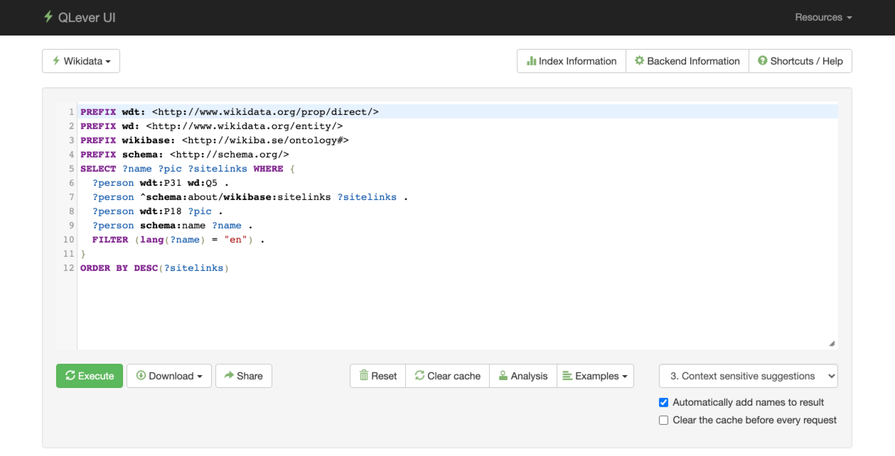

   
  

<h1 align="center">QLever UI</h1>

  A user-friendly interface for the QLever SPARQL engine  
    <strong><a href="https://qlever.cs.uni-freiburg.de/wikidata">View Demo</a></strong>
    ·
    <strong><a href="#overview">Read Documentation</a></strong>
    ·
    <strong><a href="https://github.com/ad-freiburg/QLever">QLever Engine</a></strong>

 

    

# What is QLever UI?
**QLever UI** is an easy-to-use interactive **user interface** for the **SPARQL search engine QLever** that helps to discover the scopes and information in very large knowledge bases by providing **context-sensitive suggestions** and **auto-completion** while adding helpful information and additional views to the various outputs of the queries.

QLever UI supports different types of results (e.g. geographical data, named instances, images, and more) and is highly customizable to the needs of its users and the structure of the underlying dataset. The interface includes **interactive query analysis** for exploring query execution and performance.

## Key Features

- **Context-sensitive SPARQL autocompletion** - Smart suggestions based on query context
- **Interactive query execution analysis** - Navigate through query trees to understand performance
- **Customizable result views** - Support for geographic data, images, and structured results
- **Real-time query monitoring** - Live query progress updates during execution
- **SPARQL formatting** - Automatic query formatting and syntax validation
- **Multi-backend support** - Configure and switch between different QLever instances
### What is QLever?
QLever (pronounced "clever") is an efficient SPARQL engine that can handle very large datasets. For example, QLever can index the complete Wikidata (~ 18 billion triples) in less than 24 hours on a standard Linux machine using around 40 GB of RAM, with subsequent query times below 1 second even for relatively complex queries with large result sets. On top of the standard SPARQL functionality, QLever also supports SPARQL+Text search.

For more information on QLever, visit the corresponding [QLever GitHub Repo](https://github.com/ad-freiburg/QLever).
## Authors & Copyright
© 2016 - 2022 University of Freiburg, [Chair for Algorithms and Data Structures](https://ad.cs.uni-freiburg.de/)

- @jbuerklin <jb@software-design.de>   
- @dkemen <dk@software-design.de>
- @hannahbast <bast@informatik.uni-freiburg.de>

### Publications
* *J. Bürklin*: ["QLever UI: A context-sensitive user interface for QLever"](https://ad-publications.cs.uni-freiburg.de/)
* *D. Kemen*: ["QLever UI: Building an interactive SPARQL editor to explore knowledge bases"](https://ad-publications.cs.uni-freiburg.de/)
* *H. Bast, J. Kalmbach, T. Klumpp, F. Kramer, and N. Schnelle*: ["Efficient SPARQL Autocompletion via SPARQL"](https://ad-publications.cs.uni-freiburg.de/ARXIV_sparql_autocompletion_BKKKS_2021.pdf)
### License
Distributed under the Apache 2.0 License. See `LICENSE` for more information.
# Overview
* [Building the QLever UI Docker Image](docs/install_qleverui.md#building-the-qlever-ui-docker-container)
    * [Setting up the database](docs/install_qleverui.md#setting-up-the-database)
    * [Running a QLever UI Docker container](docs/install_qleverui.md#running-a-qlever-ui-docker-container)
* [Installing QLever UI without docker](docs/install_qleverui.md#installing-qlever-ui-without-docker)
    * [Setting up the database manually](docs/install_qleverui.md#setting-up-the-database-manually)
    * [Running QLever UI without docker](docs/install_qleverui.md#running-qlever-ui-without-docker)
* [Configure QLever UI](docs/configure_qleverui.md)
* [Query Analysis](docs/query-analysis.md)
* [Extending QLever UI](#construct-and-theoretical-approach)
    * [Extending the language parser](docs/extending_parser.md)
    * [Extending the suggestions](docs/extending_suggestions.md)

